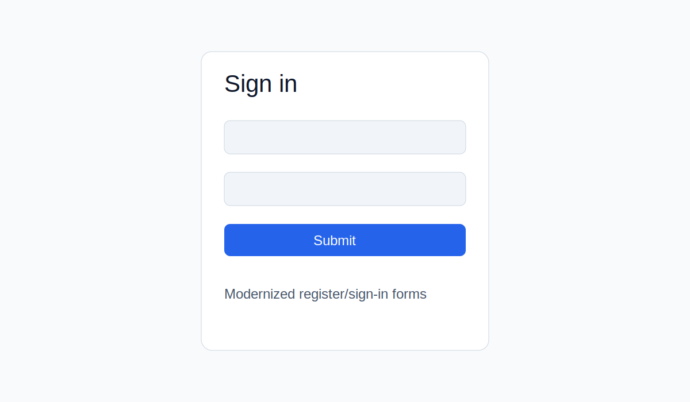

# nextjs-auth-blog-modernized

Modernized Next.js project with cleaner UI, improved navigation, reusable page layouts, and Netlify deployment.

## Live demo

https://my-nextjs-project-modernized.netlify.app

## Highlights

- Modernized, responsive UI for Home, Register, Sign in, and Dashboard pages.
- Theme toggle with light/dark mode support.
- Improved layout structure and navigation for better readability.
- Deploy-ready setup for Netlify with `@netlify/plugin-nextjs`.

## Screenshots

| Home | Auth |
|------|------|
|  |  |

## Tech stack

- Next.js 14
- React 18
- TypeScript
- Tailwind CSS
- Netlify
- MongoDB Atlas (for persistent registration data)

## Local development

```bash
npm install
npm run dev
```

Open http://localhost:3000

### Environment variables

Copy `.env.example` to `.env.local` and set:

- `MONGODB_URI`
- `MONGODB_DB_NAME`
- `MONGODB_COLLECTION`

## Build

```bash
npm run build
npm start
```

## Branch history

The original progressive course branches are still available:

- `version/initial`
- `version/toggle-theme`
- `version/toggle-theme-icon`
- `version/all-routings`
- `version/user-register`
- `version/error-logs`
- `version/logout-blogpost`
- `version/logout-jwt`
- `master`

## Free API / backend options

- There is no realistic provider that can guarantee "free forever" in legal terms.
- Best practical option: **build your own API** (already done in this repo via Next.js API routes) and connect it to a free database tier.
- Recommended free tier for this project: **MongoDB Atlas M0** (most stable for this stack).
- Alternative free tiers: Supabase, Neon, Railway trial/free tiers (policies can change).
